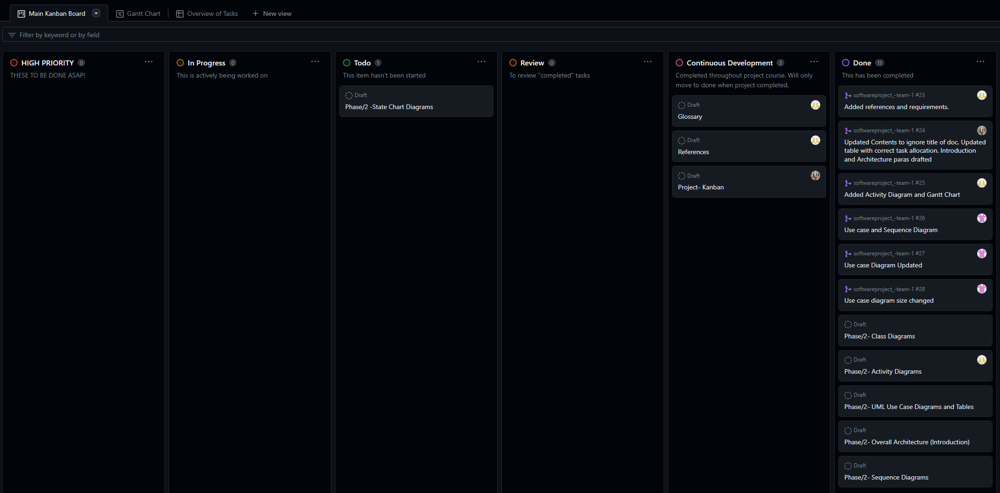

<!-- omit in toc -->
# Phase 2 - System Modelling and Design

<!-- omit in toc -->
## Team 1- Library System

<!-- omit in toc -->
## Contents

- [Introduction](#introduction)
- [Overall Architecture of the System](#overall-architecture-of-the-system)
  - [Use Case Diagrams](#use-case-diagrams)
  - [Tabular Description Of Use Case Diagram](#tabular-description-of-use-case-diagram)
  - [Sequence Diagrams](#sequence-diagrams)
  - [Class Diagrams](#class-diagrams)
  - [Activity Diagrams](#activity-diagrams)
  - [State Chart Diagrams](#state-chart-diagrams)
- [Gantt Chart](#gantt-chart)
    - [Unidimensional](#unidimensional)
    - [Objective](#objective)
    - [Deterministic](#deterministic)
    - [Analytical and Accountable](#analytical-and-accountable)
    - [Sequential](#sequential)
  - [Kanban](#kanban)
- [References](#references)
- [Requirements](#requirements)
  - [A library system](#a-library-system)
    - [Staff](#staff)
    - [Students](#students)
    - [Card Payments](#card-payments)
    - [Inventory](#inventory)
    - [Storage system of articles](#storage-system-of-articles)
    - [Data storage](#data-storage)

## Introduction

The library system design and development continues into Phase/2 documenting a list of diagrammatic sections that meticulously breakdown the system architecture into more manageable and understandable pieces whilst keeping both abstraction for the end user and technicality for the any future engineers:

- **Use Case Diagrams**- show which functions of the system interact with the environment.
- **Sequence Diagrams**- show the actions whilst using the system between the user and system components.
- **Class Diagrams**- show classes and their relationships within the system.
- **State Diagrams**- show the response of the system to any events that occur during runtime.
- **Activity Diagrams** - shows the actions the system takes, rather than the message and information flow of user and system.

This phase also includes updated references and Kanban and a new Gantt chart to display the key milestones for Phase/2 activity until delivery on 23/1/24. Previous tasks from Phase/1 have been labeled accordingly and archived to clear up the confusion between completed and ongoing tasks of Phase/2.

 

**Table 1: Task Allocation**

| Username | Tasks |
|:---:|:---:|
| [th5528e](https://github.com/th5528e) | Activity Diagrams // Class Diagrams // References // Gantt Chart 
| [Repi909](https://github.com/Repi909) | Github Admin // Introduction // Kanban // Overall Architecture
| [GeorgeElliotMathieson](https://github.com/GeorgeElliotMathieson) | State Chart Diagrams // Pull Requests
| [shuvo00000](https://github.com/shuvo00000) | Sequence Diagrams // Use Case Diagrams

## Overall Architecture of the System
The library system needs many functions specified by the customer to be implemented, for example, inventory searching, fine payment, secure login and rule-sets for both normal and super users. A lot of transactional functions exist whilst a desire for data storage and event processing also exists. The system architecture needs to create an amalgamation of many traditional application types.

**Information systems architecture** allows the developers to employ a storage base for the library information as well as include transactional features such as querying the storage base for information when required. Storage mediums can be decided by the developer team with examples such as SQLExpress Server, XML files and JSON NoSQL databases being possible solutions. Transactional systems provide secure, available and fast response functions for the application to easily query and return necessary data IBM Corporation (2021).  Secure events such as user logins and payments can be adequately processed using encryption within the base and more simple events such as a book search will be effortless. The end user will be able to use a simple but effective UI to easily navigate and operate the application. Overheads for processing and storage can be managed remotely ensuring minimal downtime and costs for the user. Security of both hardware and software can be controlled by the developers during both development and during the maintenance and support period as specified by the customer.

### Use Case Diagrams
---
A use case diagram, which shows how users interact with a system visually, is an essential tool in system design. It acts as a guide to help stakeholders communicate and direct the development process by helping to understand the functional needs of a system from the viewpoint of the user.(Srinam 2023)

 

**Figure 1: Library Management System Use Case Diagram**

 
 

 

### Tabular Description Of Use Case Diagram

**Table: Login Usecase**

| Components     | Description |
| ----------- | ----------- |
| Actors      |   Librarian, Library Member    |
| Description   | Enables users (library members and librarians) to log into the system securely. The system authenticates users based on their credentials (username and password). Users must have valid and authorized accounts to access the system. After login they can search for books.       | 
| Data      |   User credentials (username and password)    |
| Stimulas |   User command issued by a librarian or  member  |
| Response   |  Successful login or authentication failure |
|    Comments   |   Users must have valid credentials and appropriate permissions. The system should implement security measures such as encryption to protect user credentials   |

**Table: Rent Books Usecase**
| Components     | Description |
| ----------- | ----------- |
| Actors      |    Library Member    |
| Description |  Enables members to rent books from the library. Members can select a book and the days of rent. Members can rent a book for 3,7 or 15 days.    | 
| Data      |   Book information, member details, rental duration    |
| Stimulas  |   User command issued by a library member  | 
| Response  |  Confirmation of successful book renting |
| Comments  |  Availability of the book should be checked before confirming the book. The system should update the book status accordingly. |

**Table: Check Account Usecase**

| Components     | Description |
| ----------- | ----------- |
| Actors      |    Library Member   |
| Description |  Enables members to check their account status, including rent books and any fines accrued. The member can review their account details for transparency. The members can also pay there fine here through online. | 
| Data      |   Member details, rented books and fines.  |
| Stimulas     | User command issued by a library member.|
| Response     |  Display of Account details |
| Comments  |  The system should provide clear information to avoid confusion. The payment information should not be stored on the system. |

**Table: Manage Members Usecase**

| Components     | Description |
| ----------- | ----------- |
| Actors      |    Librarian   |
| Description | Allow librarian to manage members information. Librarian can include new members, update member details and also can remove the member when necessary.  |
| Data     |   User information, member details   |
| Stimulas      |    User command issued by the librarian   |
| Response      |    Confirmation of member management action  |
| Comments      |    Requires appropiate permissions and access to member data.   |

**Table: Manage Books Usecase**

| Components     | Description |
| ----------- | ----------- |
| Actors      |    Librarian   |
| Description | Allows the librarian to manage books in the library. This includes adding new books to the catalog, deleting existing books, and updating the catalog details. The librarian can ensure an accurate and up-to-date record of all library materials.  |
| Data     |   Book Information and catalog details   |
| Stimulas      |    User command issued by the librarian   |
| Response      |    Confirmation of book management actions |
| Comments      |    Requires appropriate permissions  to access and change books data.    |

**Table: Generate report Usecase**

| Components     | Description |
| ----------- | ----------- |
| Actors      |    Librarian   |
| Description | Allows the librarian to generate reports on various aspects of the library data. Reports may include information on book availability, members, borrowed books, fines, and other relevant things. The librarian can customize report criteria and export reports.   |
| Data     |   Book and member information, fines information   |
| Stimulas      |    User command issued by the librarian   |
| Response      |    Display of the generated report  |
| Comments      |    The system should support various report formats.   |

**Table: Return Books Usecase**

| Components     | Description |
| ----------- | ----------- |
| Actors      |    Librarian   |
| Description | Facilates the process of returning books to the library. Librarian processes returned books and may charge late return fines for overdue items.  |
| Data     |   Book Information and member details   |
| Stimulas      |    User command issued by the librarian   |
| Response      |    Confirmation of successful book return  |
| Comments      |    Late return may charge fine, which need to be calculated based on the return status. The system should handle fine calculations and update the book availability status.   |

### Sequence Diagrams
---

A sequence diagram is a type of Unified Modelling Language (UML) diagram that shows the messages that are sent back and forth between objects during an interaction. A sequence diagram shows a set of items, symbolised by lifelines, together with the messages they exchange throughout the course of their relationship.(IBM 2021)

 

**[ Figure 2: Sequence Diagram for Member to Reserve a book ](https://www.plantuml.com/plantuml/png/VP9HRjim38RVTGh2JmdGN20FGxiK60Pq0zPW1s1ijX4gIuP4PV3j9yaHPC5staJo8t_-j9yTesNVAu4j6mlDcxnOj2Fyelv2jW5qqAUd608eMpcWveATHyVK9yobPuszUBwI3Z6oD3fX658rT496PJvJjPtUDV3Tc2zu3PKBEafOTmz4N5lUa2blcUEyJeudtHnbdP8e4wT1SFXs7t64D_CfzQxnZgp6dfedQ0Pqxf-nNRCN4nNvA764cMVQR8ee76OQzQNUoNd5ExQUia2axoQFy2hTe71CYvrzsv9pkxqG7LLsrxoS2MrxXNZIida-HowdwZqNo_auH_ZZoOuYnt2OzyOk-Aa_J6ajmgNwmC-aFfbtSpjPPCtHEsdUidEwKliLYoytb0elKaaUrvtz85w03tnMt9RVcXAeU9a6wNAiI00iNHI707EbillV8Rmf8cT6zkufjL2t3nth7av6VqZRfvyjG4i32sJxgqMj2YRbQDteRyF5xCEXiJtG1IRTLNz4zZNFJUFccMcgU0xTlbV_0G00)**

**[ Figure 3: Sequence Diagram for Librarian to Return book and fine collection ](https://www.plantuml.com/plantuml/png/jPJ1ZjD038RlynHMJgr4No07j405McaHKWjdv2PUThIJIJIUMTItPvnfS8OjvSIjjZ_Rl_yckUE88QR1mOCz1Gvdu3D76WnsSGpGI1Q3HTy0ChWbCbFkifsTqCS5EiDnRft9CgN6tgNuH3x76ErO1c9ErT3xSNoUIwVyeovzfk540GxKZQ6VcO66G5rDVRIUoW3hN5tQOyGJSYdtby38gVO58-bvcYftQ2o2DHAD6XKr6ei0ZNIV-Rq7Tcyl6rfu67zOlsaIK_0uKFC6cWcPVygjMrCeuKL12oilwQzDWi9kjQF-1mx4oSLD38cM1KAh3ItiBKyEpxEsO-ewOjviZUcfDkJwHGUAAVXYakelBhNmuOcwvtlcH7kAQ1rl6Y6_ptTiJS6aOJ6kXKyKjU4FVg5Wjzenqt1plkgzHHjqiQw3vSk1rCFeuQiT2CO0ZzOJJ6Xx0t3LbMzJBxvL3tDcNnjKmC8LB5jFZkcra2yl5Ff41k3ctrZqxZ6IDbpLAEyGMFyuLiBaUIwr-rAIHEMWrcuB4QwCrsAzuVzP22QZv7lpZ-do8GAE61FNBkJy0Wbpd97whRZWwuoqhUCYiIBoyQjOFnYQKy76t97lq-1-0G00)**

### Class Diagrams
---
### Activity Diagrams
**Activity** diagrams are behavioral diagrams that describe activity aspects within a system. An activity diagram moves just like a flow chart does, but does so with specific markers used for statements such as: if, switch and while. Other markers can denote the start, stop, parallel activities and swim lanes.

The Activity diagram for this project depicts the process of the program from start to end, featuring all requested functional requirements, such as: a late fee system at 10p per day late, renting only in 3, 7 and 14 day intervals, having a teacher account that can control setup of new accounts and deletion of old accounts, amongst other requirements.

**[Figure 1: Activity Diagram](https://www.plantuml.com/plantuml/png/hLLBRzj64BxlhnYWXqf03Z6QHoiU6iT9NGDjuSOfu4Cl8-vGMdWVpEnIgbhqltSu94LLIdgg3kPovfjlldci-IONvD85R_AJYoqo1iXRj6dluWOATsHCSSKJNDV5xLmvm3k7cnxs_WyChQVVepc9nGdrbm7vFVJiDyad1ky2RPWegkDzj8FP8Z-jVKTgVOlrquPJDpc_iYyilHnzYItnQ7z9tub7xTVCQJ-OrrxYpT-VaIEQGufML5scKJfBhxxzppHDYkN1_KbmzKeo66sRoNjNwYqiVaeR5q4YVkrS-NvfQim4YzyoCTniavmLi3HCBM4P7x1IW4ZjIeQo9SVGMo860XInzvZpNkHKnamX-wtpmdoNeHsTK2TcgYKhk0oBc9OGKu75WV9I0YU5zyJ1vUnIp9Eyevm9yv6mtXBBf6lfJPbnHuGA_XaZRYZGAG9WTSF2HO1QGsLM4vlWYBK-YBI7JhnVP-YB5D1hgBV8M2iaDOfgalUwVdBYW0MGIM0fK-mjYXbPkkW-TSFRIFXHd9gHhEOGKECu5_1Kn3hbK9issQCSnk0FlzngXXSGkx0cphtjvXOMBCWKPgsmeKYC9V5I0wv6Ui4_FZwNtoEuQQHIjF9BfaFgIcLEc_QEF6dJSakrQnnPwBHzhe75DHD82EIEISOhT76Ognat9uFLUDaGyfbq-eQYTKt_TnYQcVEjP0i71RFxRB5k4wpbSa19WCCMGA3OwN9fxd6xl39zSPCUIcSfbijDMasUkxYJH-93TGmwcaxW7yGYcr2D5SiMf4mP4DOfgKeMmD2jEstuuC0TEezhVzQsATEFQGy1um4i7lB4qWzolBfzvc-gu_7rVBnwKPqsR_LMicaqsMU0rf8LEbFddL0NN4lKCoWkK2uOsi_CQRvYVQsbu_Z5Qat3AOmxDSx6oDj1hmTFiPUzy5ZEjqU4mjNpLbtG445BtFT23PSQpUd2NAxJRBWNYX-8SYL7JvZ7gmWriWLB1PtFfm87nmwzisSAhqkXqFQZXnOFGOSiz7g2W5RQAgbpmMXxJ2D9ePQK_AyUpo4n3M7LMDB_TW5cdZEYuKjm-J_vyjiWo5CY4Sr9Fx2Vn27zoYMrvetuk-3_0G00)**

![Activity Diagram](https://www.plantuml.com/plantuml/png/hLLBRzj64BxlhnYWXqf03Z6QHoiU6iT9NGDjuSOfu4Cl8-vGMdWVpEnIgbhqltSu94LLIdgg3kPovfjlldci-IONvD85R_AJYoqo1iXRj6dluWOATsHCSSKJNDV5xLmvm3k7cnxs_WyChQVVepc9nGdrbm7vFVJiDyad1ky2RPWegkDzj8FP8Z-jVKTgVOlrquPJDpc_iYyilHnzYItnQ7z9tub7xTVCQJ-OrrxYpT-VaIEQGufML5scKJfBhxxzppHDYkN1_KbmzKeo66sRoNjNwYqiVaeR5q4YVkrS-NvfQim4YzyoCTniavmLi3HCBM4P7x1IW4ZjIeQo9SVGMo860XInzvZpNkHKnamX-wtpmdoNeHsTK2TcgYKhk0oBc9OGKu75WV9I0YU5zyJ1vUnIp9Eyevm9yv6mtXBBf6lfJPbnHuGA_XaZRYZGAG9WTSF2HO1QGsLM4vlWYBK-YBI7JhnVP-YB5D1hgBV8M2iaDOfgalUwVdBYW0MGIM0fK-mjYXbPkkW-TSFRIFXHd9gHhEOGKECu5_1Kn3hbK9issQCSnk0FlzngXXSGkx0cphtjvXOMBCWKPgsmeKYC9V5I0wv6Ui4_FZwNtoEuQQHIjF9BfaFgIcLEc_QEF6dJSakrQnnPwBHzhe75DHD82EIEISOhT76Ognat9uFLUDaGyfbq-eQYTKt_TnYQcVEjP0i71RFxRB5k4wpbSa19WCCMGA3OwN9fxd6xl39zSPCUIcSfbijDMasUkxYJH-93TGmwcaxW7yGYcr2D5SiMf4mP4DOfgKeMmD2jEstuuC0TEezhVzQsATEFQGy1um4i7lB4qWzolBfzvc-gu_7rVBnwKPqsR_LMicaqsMU0rf8LEbFddL0NN4lKCoWkK2uOsi_CQRvYVQsbu_Z5Qat3AOmxDSx6oDj1hmTFiPUzy5ZEjqU4mjNpLbtG445BtFT23PSQpUd2NAxJRBWNYX-8SYL7JvZ7gmWriWLB1PtFfm87nmwzisSAhqkXqFQZXnOFGOSiz7g2W5RQAgbpmMXxJ2D9ePQK_AyUpo4n3M7LMDB_TW5cdZEYuKjm-J_vyjiWo5CY4Sr9Fx2Vn27zoYMrvetuk-3_0G00 "Activity Diagram")

### State Chart Diagrams

## Gantt Chart

Written in the popular app Mermaid for chart creation, this Gantt chart shows the planning for phase 1 of this project and will be fleshed out to show phases 2 and 3 when they have been finalised.

The Gantt chart, Kanban/Table, Introduction, and Glossary are to be drafted by the 23rd of November 2023. This is to allow for clarity in what is completed/to be completed so far within the project and to give a base to other sections of the project, thus boosting the team's confidence via means of a visible road map.

A Gantt chart is well known to be an intuitive, simple, practical and useful visual representation of activities and their associated durations. They are a very widely used tool within industry and are built to focus on 5 main areas.

#### Unidimensional
* One view being 'time', emphasising efficiency.

#### Objective
* Object-oriented.

#### Deterministic
* A Gantt chart determines all that will occur in the project.

#### Analytical and Accountable
* Division of the project allows for smaller bite-sized chunks so resources can be allocated efficiently.

#### Sequential
* After tasks have been completed, then the next task is to be completed, thus sequentially.

A Gantt chart is well known to be an intuitive, simple, practical and useful visual representation of activities and their associated durations. They are a very widely used tool within the industry and are built to focus on 5 main areas. (Geraldi & Lechler, 2012)

**[Figure 2: Project Plan Gantt Chart, Phase 2 Update](https://mermaid.ink/img/pako:eNq9Vm1v2jAQ_itWPidtE7q2y7eqqNW0oVXQaprEFxMf4C1xsrPdClX97zs7LyQMtlXTQAiS3HPPPXe-c_wSZKWAIA1WXBkzV4w-Rpoc2APwgsXsHstvkBl25-zsZs2xQQlu4LbEghvGxuNoMom-0meuaqsmH1kqNiuX5pkjOJ4MtGYTCpfXmLHUmdXawdIMpQl1VYgwGUVxHCVnyShksaiRX8gKka0YV4JNYQkIithScni2GPKlAWTe-6LxmMKThGeWdiaHa-mGEh81Iabww0qEApTRB9RZHIj7kzaLW2nOdVeZxa31sLjZRhso_kaexjfWrqdP79GHDtDZDyucSv1d1-R0xaqcKyXV6vfBESvH2NN7KX7Jq_ap1fgUyUu0khuGLs0TlsbxKX09224bflAGS2H9TW259_fAxkh85HvRq9xVw3krFc-lhqH6pqeqOIsJ-35vUR74IofTj1wt-FHi3eWl1hw3_xqL7Q920j7P4r0t0C1s20It3R03a0BqB-onXIUDJaOGfGYXhTQ9Et973TKvetCdpHe3pJ28fRL9kJdvyb1trPs1J2TCbOV2PKrmeRQnNeGVaCRtfzpxn58AeZ6za8zWNAOZsQj7V2fLty34gU44S6Izn8z5wU54nHxyOxq7carHkq-QF_V4-p7Ux9Awo93KV7SJf4yYNzmnt8sRA17T35M0m2PGnBnXgr7ju7X9n3HbbXSowk-E7k9H7IZtMGrJxc74pFUS9lWNrgaAEQFG7n3QSXl3LoIwKIBOGFLQAeXFwecB7ScFzIOULgUsuc3NPJirV4Jya8rZRmVBatBCGNQD25QpSJc81_QUhDQlTupDjz_7vP4EwNzBfw?type=png)**

### Kanban

Kanban is a method of improving software development by means of creating a visual flow using boards and charts. The idea is to promote team communication, collaboration and visibility of project timelines and projections Radigan, D. (2022).

Kanban originates from the manufacturing industry, specifically Taiichi Ohno from Toyota in Japan, where it literally translates to "signboard". Toyota continue their Kanban philosophy under a new name, "Just-in-Time" method TOYOTA (2023), where they focus more on incorporating lean principles however Kanban, in the last decade, has been on the rise in tech and is being used in an array of diverse software organisations.

Below is a screenshot of our project Kanban from 21/01/24 and will change throughout the project to include new tasks as they are defined and allocated. The board has been split into major categories that define each task's state which project contributors can use to visualise the progress of the overall project.

**[Figure 3: Kanban Board 21/01/24](https://github.com/orgs/TeachingMaterial/projects/9)**

## References
- Put references in like you did last time so th5528e can add them
  
Srinam (2023). Use Case Diagram. Retrieved from Geeks for Geeks : https://www.geeksforgeeks.org/use-case-diagram/.

IBM (2021). Sequence Diagrams. Retrieved from IBM : https://www.ibm.com/docs/en/rsm/7.5.0?topic=uml-sequence-diagrams.

IBM Corporation (2021) IBM Documentation, Transaction Processing Systems. Available at: https://www.ibm.com/docs/en/txseries/9.1?topic=processing-transaction-systems

Toyota production system . [online] Toyota Motor Corporation Official Global Website. Available at: https://global.toyota/en/company/vision-and-philosophy/production-system/.

Radigan, D. (2022). What is kanban? [online] Atlassian. Available at: https://www.atlassian.com/agile/kanban.

## Requirements
### A library system
#### Staff
- Staff all have the same access level.
- Staff can create a user.
- "Staff can delete a user, but a confirmation window will occur when asking to delete a user."
#### Students
- Students will have a lower access level with limited access.
- Students can look at their own account and pay any outstanding balances.
#### Card Payments
- There needs to be a card processing system for payment.
- Payment cannot be stored.
- A validation check is required and keep in mind all credit card numbers depending on vendor have a different starting number.
#### Inventory
- 20 books, at least 3 should be journals.
  - Books require:
    - Titles
    - ISBN number
    - Authors
    - Synopsis - Find one, don't write it.
  - Journals require:
    - Titles
    - Authors
    - DOI number
    - Journal name
    - Conference paper name of the journal name (Seb's words)
#### Storage system of articles
- Must use the Dewey Decimal System.
- Renting
- Books can only be rented in 3, 7, and 14 day intervals at a time.
- Renting starts the same day they take out the article.
- 10p late fee per day late.
#### Data storage
- JSON, XML, CSV, matrix -  any of these to show what each student has taken out (perhaps start all csv/text files with words so that the files can be identified as book logs - Toby idea).
