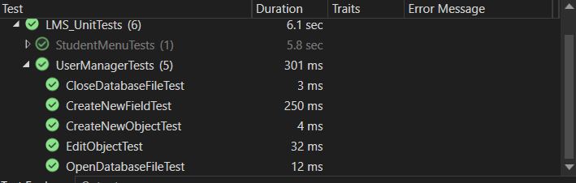
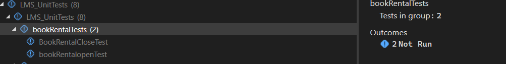

<!-- omit in toc -->
# Phase 3 - Implementation and Testing

<!-- omit in toc -->
## Team 1- Library System

<i>(bedbugexterminatorpro.ca, 2023)</i>

<!-- omit in toc -->

## Contents 
- [Contents](#contents)
- [Task Allocation](#task-allocation)
- [Implementation](#implementation)
  - [The `InventoryManager` Class](#the-inventorymanager-class)
  - [The `UserManager` Class](#the-usermanager-class)
  - [The `paymentGateway` partial class](#the-paymentgateway-partial-class)
  - [The `bookRental` partial class](#the-bookrental-partial-class)
  - [The `studentMenu` partial class](#the-studentmenu-partial-class)
  - [The `teacherMenu` partial class](#the-teachermenu-partial-class)
  - [The `loginScreen` partial class](#the-loginscreen-partial-class)
  - [The `bookRental` partial class](#the-bookrental-partial-class-1)
  - [The `studentMenu` partial class](#the-studentmenu-partial-class-1)
  - [The `teacherMenu` partial class](#the-teachermenu-partial-class-1)
  - [The `loginScreen` partial class](#the-loginscreen-partial-class-1)
  - [The `paymentGateway` partial class](#the-paymentgateway-partial-class-1)
- [Testing](#testing)
    - [`teacherMenuTests`:](#teachermenutests)
    - [`userManagerTest`:](#usermanagertest)
    - [`bookRentalTest`:](#bookrentaltest)
    - [`paymentGatewayTest`:](#paymentgatewaytest)
- [Kanban](#kanban)
- [Gantt Chart](#gantt-chart)
- [Acknowledgements](#acknowledgements)
- [References](#references)
  
## Task Allocation

**Table 1: Task Allocation**

| Username | Tasks |
|:---:|:---:|
| [th5528e](https://github.com/th5528e) | UI/XAML Design // Kanban // Inventory Testing
| [Repi909](https://github.com/Repi909) | Github Admin // User/Inventory Classes and Interface // Login and StudentMenu Testing
| [GeorgeElliotMathieson](https://github.com/GeorgeElliotMathieson) | Pull Requests // Hashing and Auth // TeacherMenu Testing
| [shuvo00000](https://github.com/shuvo00000) | README.md // Payment Methods // UserManager and bookRent Testing
| [shuvo00000](https://github.com/shuvo00000) | README.md // Payment Methods // UserManager and bookRent Testing

## Implementation

### The `InventoryManager` Class
---

**The `InventoryManager` class** is responsible for managing the inventory of books and journals in the library system. It contains several methods that facilitate operations such as adding, deleting, editing, and retrieving inventory items and their information. 

**Core Methods**

**`OpenDatabaseFile()`:**

Opens the inventory database file(`.csv` format) and reads its contents into memory.

**`CloseDatabaseFile()`:**

Closes the inventory database file and saves the current state of the inventory data back to the database file. It concatenates the `tableHeaders` and `inventoryList` into a list of strings and writes it line by line to the CSV file.

**`CreateNewObject()`:**

Adds a new item to the inventory. It validates the input object items, checks if an item with the same name already exists, and adds the new item to the `inventoryList`.

**`DeleteObject()`:**

Deletes an item from the inventory.

**`GetObjectInfo()`:**

 Retrieves all information for a specific object (inventory item) by its name. It uses the `FindObjectInList` helper method to locate the object's index and then returns the entire row from `inventoryList` at that index.

**`EditObject:`**

Edits information about an item in the inventory. It uses helper methods to find the object's and field's index, then removes the old value and inserts the new edited value in the inventoryList.

**`FindObjectInList` and `FindFieldNameInList`:**

 These helper methods iterate through specific columns in the inventoryList to find the index of an object by name or a field, respectively.

---

### The `UserManager` Class
---

The `UserManager`class is responsible for managing user data, such as adding, editing, or deleting user data.

**Core Methods**

**`OpenDatabaseFile()`:**

Opens the Uer database file and reads its contents into memory. Reads the user data from a CSV file located at the specified path and initializes the `userList` and `tableHeaders` properties with the data read from the file.

**`CloseDatabaseFile()`:**

The purpose of this method is to save any changes made to the user data in the database file. The method first closes the user database file, then prepares the data to be written back to the file and writes the updated user data back to the database file to effectively save any changes made to the user data.

**`CreateNewObject()`:** 

Adds a new user to the user database. It validates the input user data, ensuring that it is not null and that the object name does not already exist in the database. If no issues are found, it adds the new user to the `userList`.

**`DeleteObject()`:**

Deletes a user entry from the database. It finds the index of the user by name and removes it from the `userList`.

**`EditObject()`:** 

Edits user information in the database. This method finds the user by name, locates the field to edit, and updates its value with the new information provided.

**`GetObejectInfo()`:**

To retrieve information about a specific user in the user database. It finds the user by name and returns its information as a list of strings.

**`GetSpecificObjectData()`:**

Retrieves specific data about a user from the user database. It finds the user by name, retrieves the index of the specified field, and returns the corresponding data for that field.

**`ToSHA512()`:**

Serves for password hashing using a secure algorithm (SHA512) for password storage.

---

### The `paymentGateway` partial class

The `paymentGateway` class is responsible for handling payment from the users through various types of cards. It facilitates the process of users making payments towards their owed fees or balances.

**Core Methods**

**`payFeesButton_Click`:**

Handles the logic for processing payments when the user clicks the "Pay Fees" button. It gathers information such as the credit card number, expiry date, CVC, and payment amount entered by the user. It validates the credit card details, checks if the payment amount exceeds the owed balance, and updates the user's balance in the database accordingly. If the payment is successful, it displays a confirmation message and navigates the user back to the student menu window.

**`IsValidCreditCard()`:**

Validates the credit card details entered by the user. It verifies that the credit card number, expiry date, and CVC meet the necessary criteria for a valid credit card.

**`GetCardType()`:**

This method determines the type of credit card based on its number. 

---
### The `bookRental` partial class

This class is responsible for handling searching and renting books in the library management system. Users are able to search for books or journals by entering the title, author, or ISBN number and they are allowed to rent books for 3,7 or 14 days.

**Core Methods**

**`titleSearch_TextChanged()`:**

Filters the list of available books based on the entered title, updating the search results displayed.

**`isbnSearch_TextChanged()`:**

It filters the books based on the ISBN number entered by the user and shows possible results.

**`authorSearch_TextChanged()`:**

Filters the available books and journals list by the searched author name and displays the result.

**`submitButton_Click()`:**

This function processes the selected book or journal for renting. This function updates the status of the book and records the rental duration and show the confirmation message upon button clicked.

---

### The `studentMenu` partial class

The `studentMenu` class in the LMS_WPFApp responsible for managing the user interface and interactions related to student-specific functionalities within the application. It provides options for students to view their own account, pay any outstanding balances and rent any books.

**Core Methods**

**`payFeesButton_Click()`:**

Opens the payment gateway window to allow the students to pay their outstanding balance. This also Retrieves the current outstanding balance and passes it to the payment gateway window.

**`rentBookButton_Click()`:**

Navigates to the bookRental window for allowing students to rent books.

**`LoadDebtFromCSV()`:**

Shows the current outstanding balance of the user also the updated amount after paying.

---

### The `teacherMenu` partial class

This class provides options for staff or teachers to manage user accounts, such as deleting existing accounts, creating new user accounts or editing information of the user.

**`deleteUserButton_Click()`:**

Deletes the existing user from the user data after confirming the deletion with a message box.

**`createUserButton_Click()`**

Allows staff to create a new user. This function also hashes the password using SHA512 before adding it to the user data.

**`GenerateUsername()`**

it generates a unique username based on the provided first name and last name. this function instructs the username using the first letter of the first name, first letter of the last name, a random number, and a random letter.

---

### The `loginScreen` partial class

This class handles user login attempts, verifies credentials, and directs users to the appropriate menu based on their access level.

**Core Methods**

**`loginButton_Click()`:**

It provides a username and password input for users. Then it checks if the username exists in the user database and if the provided password matches the one stored in the database managed by the `UserManager` class. Then it provides message for unsuccessful login attempts. If the login is successful it navigates the users to the appropriate menu based on their access level.

---
### The `bookRental` partial class

This class is responsible for handling searching and renting books in the library management system. Users are able to search for books or journals by entering the title, author, or ISBN number and they are allowed to rent books for 3,7 or 14 days.

**Core Methods**

**`titleSearch_TextChanged()`:**

Filters the list of available books based on the entered title, updating the search results displayed.

**`isbnSearch_TextChanged()`:**

It filters the books based on the ISBN number entered by user and shows the possible result.

**`authorSearch_TextChanged()`:**

Filters the available books and journals list by the searched author name and displays the result.

**`submitButton_Click()`:**

This function processes the selected book or journal for renting. This function updates the status of the book and records the rental duration and show the confirmation message upon button clicked.

---

### The `studentMenu` partial class

The `studentMenu` class in the LMS_WPFApp responsible for managing the user interface and interactions related to student-specific functionalities within the application. It provides options for students to view there own account, pay any outstanding balances and rent any books.

**Core Methods**

**`payFeesButton_Click()`:**

Opens the payment gateway window to allow the students pay there outstanding balence. This also Retrives the current outstanding balance and passes it to the payment gateway window.

**`rentBookButton_Click()`:**

Nevigates to the bookRental window for allowing students to rent books.

**`LoadDebtFromCSV()`:**

Shows the current outstanding balance of the user also the updated amount after paying.

---

### The `teacherMenu` partial class

This class provides options for staff or teacher to manage user account, such as deleting existing account, creating new accont or edit information of the user.

**`deleteUserButton_Click()`:**

Deletes the existing user from the user data after confirming the deletion with a message box.

**`createUserButton_Click()`**

Allows staff to create new user. This function also hashes the password using SHA512 before adding it to the user data.

**`GenerateUsername()`**

it generates a unique username based on the provided first name and last name. this function instructs the username using the first letter of the first name, first letter of the last name, a random number, and a random letter.

---

### The `loginScreen` partial class

This class handles user login attempts, verifies credentials, and directs users to the appropriate menu based on their access level.

**Core Methods**

**`loginButton_Click()`:**

It provides a username and password input for users. Then it checks if the username exists in the user database and if the provided password matches the one stored in the database managed by the `UserManager` class. Then it provides a message for unsuccessful login attempts. If the login is successful it navigates the users to the appropriate menu based on their access level.

---

### The `paymentGateway` partial class

This class handles the payment section of the application.

**Core Methods**

**`payFeesButton_Click()`:**

Upon the button click, the cardNumberText.Text, expiryDateText.Text, CvcText.Text and PaymentText.Text have their values stored in string and float parameters. These Parameters are then used to validate the card details, and pay the amount entered in to the PaymentText.Text textbox. The method from the Users class 'EditObject' is then used to change the stored amount of money owed in the userDatabase.csv.

**`IsValidCreditCard()`:**

This is a private void method which takes the cardNumber, expiryDate and cvc and strings and checks their lengths to ensure the right amount of characters are entered in to the relevant text boxes.

**`GetCardType()`:**

A private string that takes the cardNumber value, and removes any spaces or '-' characters to make one long string value to use in the cleanCardNumber value to identify which card is being used, where a card number starting with 4 is Visa, 5 is Mastercard, and 34 is American Express.

**`cancelPayFeesButton_Click()`:**

This takes the user back to the studentMenu window.

**`TextBox_TextChanged()`:**

Placeholder function.

**`CardNumberText_TextChanged()`:**

Placeholder function.

**`PaymentText_TextChanged()`:**

Placeholder function.

---

## Testing

**Testing Strategies**

The team employed a variety of testing strategies to ensure the reliability and functionality of the program. 

**Integration Test**

Integration testing is performed to test how the individual components of the program work together as a whole.

**Unit Test**

Unit testing is used to test individual components or units of the program in isolation.

**UI Testing**

Tests the user interface elements and their behaviour. It verifies the window opens and closes as expected and ensures UI elements function correctly based on user interaction.

#### `teacherMenuTests`:

The `teacherMenuTests` class contains unit tests for the following high-level teacher menu functionality:
- Opening window
- Closing window
- Generating usernames
- Creating new users
- Deleting users
- Database handling

All tests passed successfully (as shown in **Figure 1**), and the teacher menu functionality was verified to be working as expected.

**[Figure 1: Teacher Menu Test Results]()**

#### `userManagerTest`:

**Table 2: UserManager Test Cases and Result**

| Test case | Description | Result | Passed/Failed
|:---:|:---:|:---:|:---:|
|` OpenDatabaseFileTest` | Tests the `OpenDatabaseFile` method in UserManager to ensure it correctly reads the database file. | Database file is successfully opened  and `userList` and `tableHeader`s are populated. | Passed 
| `CloseDatabaseFileTest` | Tests if the method properly close the database file and save if any changes occur | Successfully closed the database and saved the updated data | passed
| `CreateNewFieldTest` | Tests if `CreateNewField` method successfully creates a new field to table headers and initializes it with empty value | Successfully Created a new field to `tableHeader` and has empty values for all the user in `userList` | Passed
| `CreateNewObjectTest` | Test the CreateNewObject to ensure it's correctly create a new user or object to an existing `userList` | The new object successfully added to `userList`| Passed
| `EditObjectTest` | Test the EditObject function to ensure it correctly modify existing object's field value | Successfully modify an exististing object's field value | Passed 

**[Figure 2: UserManager Test Results]()**

#### `bookRentalTest`:

**Table 3: bookRental Test Cases and Result**
| Test case | Description | Result | Passed/Failed
|:---:|:---:|:---:|:---:|
|`bookRentalOpenTest` | Tests If the `bookRental` Window open successfully | The window opens when the program run but the test not running in test explorer | Not Run
| `bookRentalCloseTest` | Tests If the `bookRental` WIndow closes successfully | The window closes when the program run but the test not running on test explorer | Not Run

**[Figure 3: bookRental UI Test Results]()**

#### `paymentGatewayTest`:

**Table 4: paymentGateway Test Cases and Result**
| Test case | Description | Result | Passed/Failed
|:---:|:---:|:---:|:---:|
|`TestGetCardType_Visa` | Tests the `getCardType` function to see what card is being used to pay with. This test tries to use the Visa card. It also tests to see if the window opens successfully | The window opens when the program is run, and the test passes as well, only when the `getCardType` function is run as public. | Run
| `TestIsValidCreditCard_Valid` | Tests the UI`IsValidCreditCard` function. And tests the UI by loading and closing the test window. | The window closes and no errors are found. | Run

**[Figure 4: paymentGateway UI Test Results]()**

## Kanban

Kanban is a method of improving software development by means of creating a visual flow using boards and charts. The idea is to promote team communication, collaboration and visibility of project timelines and projections (Radigan, 2023).

Kanban originates from the manufacturing industry, specifically Taiichi Ohno from Toyota in Japan, where it literally translates to "signboard". Toyota continue their Kanban philosophy under a new name, "Just-in-Time" method (Toyota, 2023), where they focus more on incorporating lean principles however Kanban, in the last decade, has been on the rise in tech and is being used in an array of diverse software organisations.

Below is a screenshot of our project Kanban from 21/01/24 and will change throughout the project to include new tasks as they are defined and allocated. The board has been split into major categories that define each task's state which project contributors can use to visualise the progress of the overall project.

**[Figure 5: Kanban Board Phase/3](https://github.com/orgs/TeachingMaterial/projects/9)**

## Gantt Chart
Written in the popular app Mermaid for chart creation, this Gantt chart shows the planning for phase 1 and 2 of this project, of which phase 1 is already completed. Phase 3 will be fleshed out in the future once phase 2 is completed on the 23rd of January 2024.

The Gantt chart, Overall Architecture, Sequence Diagram, Class Diagram, Activity Diagram and State Chart Diagrams are to be drafted by the 2nd of January 2024. After this period, the diagrams and information are to be finalised and referenced. This again will give clarity in what is completed/to be completed in the future of the project, to give the team a boost in moral via means of a visible road map.

A Gantt chart is well known to be an intuitive, simple, practical and useful visual representation of activities and their associated durations. They are a very widely used tool within industry, and are built to focus on 5 main areas (Geraldi & Lechler, 2012).

**Unidimensional**
* One view being 'time', emphasising efficiency.

**Objective**
* Object-oriented.

**Deterministic**
* A Gantt chart determines all that will occur in the project.

**Analytical and Accountable**
* Division of the project allows for smaller bite-sized chunks so resources can be allocated efficiently.

**Sequential**
* After tasks have been completed, then the next task is to be completed, thus sequentially.

 

**[Figure 6: Project Plan Gantt Chart, Phase 3 Update](https://mermaid.ink/img/pako:eNrFVttum0AQ_ZUVz5AYSGKHtyhOoqpFjexEVSW_rNmxvQ0sdC-xrCj_3uFqTHDbqCqxLBuYmXPO7M7O8GJFKQMrsNZUaL0QBD-a6xjIA9CEuORepj8g0uQut5PrDZWVF6MablOZUE3IdOqEofMdPwtRWhXG8FSQebrSWyohx4lAKRIiXVz6TLmKjFK5WxBJrm2VJcz2fMd1HW_k-TZxWen5Da3gmIxQwcgMViBBIFqAAVsjbbrSIEkRfVFFzOCZw5YEjSn3q-EOJT4q9JjBT8MlJCC0OqLOyANxf9Jm5F5aHtpVZuTeelzcfKc0JH8jT8l3rl1Ln-rRJ3OHxn5c4YyrJ1WC4xXJYioEF-vfk0uZ5YgtvWP2Jq8yplRTpIhRrJZcITRpnpDAdU_xW6B1y_CT0DJlprgpLffFPZCpRDyMvWit3KTCvOWCxlzBofqqpjI3ctH3sndRHugyhtPPVCzpIHx3caoUlbt_5SL9ZCf188jtLYFmY-sSquHuqN6AxHLAepJr-0CJX4HPzTLhugVS1F6zzeuWayfpbkvq5F0k0aYcvyf3urDuNxQ9PWKyvOPhap45rlcCTlglaf_TiPv6DJLGMbmS0QbPQKSNhP7d2ePtF_xIJYw8Z1Qkc3a0Eh7DL3lHI9e56imna0mT8ngWNamG0DDHblWsaMU_BOd1THG6DEh4hX_PXO-G5JzrvASLim_29n_ydttonK65mEcSoL-rYT9voPzzLm3gjZ2RVzOdVeZHgYdfg9JFl0DVI79y8bzeRcjoLp-D2FpgS3dD6KhbQa1AacNQQQjCfAS9BhphV_0o-mWaPs0w_WbID0s_u7mahjcnCesnb6H7o7fkkz3yOdsXeV-dFY1ftYeAm8-Ug4niXXSmRJB5dvvw-ZMDBx8dfLu9QuMRs2wrAXyR5gzfw19y94WFYzOBhRXgJYMVNbFeWAvxiq7U6HS-E5EVaGnAtsq5VHUDK1jRWOFTYFynMizf7YtX_Ndfh4-RJw?type=png)**

![Project Plan Gantt Chart](https://mermaid.ink/img/pako:eNrFVttum0AQ_ZUVz5AYSGKHtyhOoqpFjexEVSW_rNmxvQ0sdC-xrCj_3uFqTHDbqCqxLBuYmXPO7M7O8GJFKQMrsNZUaL0QBD-a6xjIA9CEuORepj8g0uQut5PrDZWVF6MablOZUE3IdOqEofMdPwtRWhXG8FSQebrSWyohx4lAKRIiXVz6TLmKjFK5WxBJrm2VJcz2fMd1HW_k-TZxWen5Da3gmIxQwcgMViBBIFqAAVsjbbrSIEkRfVFFzOCZw5YEjSn3q-EOJT4q9JjBT8MlJCC0OqLOyANxf9Jm5F5aHtpVZuTeelzcfKc0JH8jT8l3rl1Ln-rRJ3OHxn5c4YyrJ1WC4xXJYioEF-vfk0uZ5YgtvWP2Jq8yplRTpIhRrJZcITRpnpDAdU_xW6B1y_CT0DJlprgpLffFPZCpRDyMvWit3KTCvOWCxlzBofqqpjI3ctH3sndRHugyhtPPVCzpIHx3caoUlbt_5SL9ZCf188jtLYFmY-sSquHuqN6AxHLAepJr-0CJX4HPzTLhugVS1F6zzeuWayfpbkvq5F0k0aYcvyf3urDuNxQ9PWKyvOPhap45rlcCTlglaf_TiPv6DJLGMbmS0QbPQKSNhP7d2ePtF_xIJYw8Z1Qkc3a0Eh7DL3lHI9e56imna0mT8ngWNamG0DDHblWsaMU_BOd1THG6DEh4hX_PXO-G5JzrvASLim_29n_ydttonK65mEcSoL-rYT9voPzzLm3gjZ2RVzOdVeZHgYdfg9JFl0DVI79y8bzeRcjoLp-D2FpgS3dD6KhbQa1AacNQQQjCfAS9BhphV_0o-mWaPs0w_WbID0s_u7mahjcnCesnb6H7o7fkkz3yOdsXeV-dFY1ftYeAm8-Ug4niXXSmRJB5dvvw-ZMDBx8dfLu9QuMRs2wrAXyR5gzfw19y94WFYzOBhRXgJYMVNbFeWAvxiq7U6HS-E5EVaGnAtsq5VHUDK1jRWOFTYFynMizf7YtX_Ndfh4-RJw?type=png)

## Acknowledgements

We would like to thank the following for their contributions and support with this project:

[CompEng0001](https://github.com/CompEng0001) for his guidance. 

Nathaniel Sadler, for his donation of Logo designs (Sadler, 2024).

## References

bedbugexterminatorpro.ca, 2023. library.jpg. [Online] 
Available at: https://www.bedbugexterminatorpro.ca/wp-content/uploads/2019/05/libraries.jpg

Geraldi, J. & Lechler, T., 2012. Gantt Chart and the Scientific Management in Projects. International Journal of Managing Project in Business, 5(4), pp. 578-594.

IBM, 2024. Processing Transaction Systems. [Online] 
Available at: https://www.ibm.com/docs/en/txseries/9.1?topic=processing-transaction-systems
oclc.org, 2023. Dewey Services. [Online] 
Available at: https://www.oclc.org/en/dewey.html

Radigan, D., 2023. Software Development - Kanban. [Online] 
Available at: https://www.atlassian.com/agile/kanban

Sadler, N. N., 2024. Logo resources, LMS. Bromley: Nathaniel Sadler Motion Design: https://vimeo.com/nathanielsadler.

Toyota, 2023. Toyota Production System - Company Information, Vision & Philosophy. [Online] 
Available at: https://global.toyota/en/company/vision-and-philosophy/production-system/

