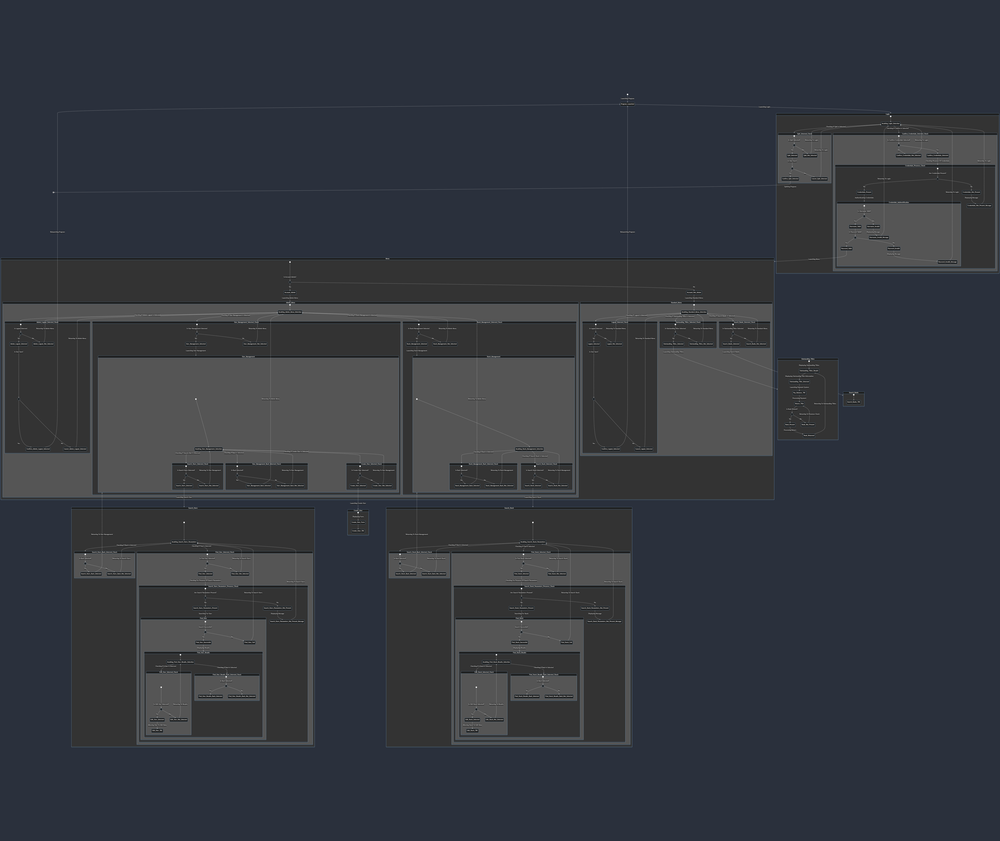

<!-- omit in toc -->
## Team 1- Library System

<!-- omit in toc -->
## Contents
- [Phase 1 - Requirements Engineering](#phase-1---requirements-engineering)
  - [Introduction](#introduction)
  - [Glossary](#glossary)
  - [Software Process Model](#software-process-model)
    - [Explanation of Incremental model](#explanation-of-incremental-model)
    - [Incremental model stages:](#incremental-model-stages)
    - [Advantages and Disadvantages](#advantages-and-disadvantages)
      - [Advantages](#advantages)
      - [Disadvantages](#disadvantages)
    - [Reasons for choosing the Incremental model](#reasons-for-choosing-the-incremental-model)
  - [User Requirements](#user-requirements)
    - [Functional Requirements](#functional-requirements)
    - [Non-Functional Requirements](#non-functional-requirements)
  - [Technical Requirements](#technical-requirements)
    - [Functional:](#functional)
    - [Non-Functional:](#non-functional)
  - [Potential Risks](#potential-risks)
- [Phase 2 - System Modelling and Design](#phase-2---system-modelling-and-design)
  - [Introduction](#introduction-1)
  - [Overall Architecture of the System](#overall-architecture-of-the-system)
    - [Use Case Diagrams](#use-case-diagrams)
    - [Tabular Description Of Use Case Diagram](#tabular-description-of-use-case-diagram)
    - [Sequence Diagrams](#sequence-diagrams)
    - [Class Diagrams](#class-diagrams)
    - [Activity Diagrams](#activity-diagrams)
    - [State Chart Diagram](#state-chart-diagram)
  - [Project Planning](#project-planning)
    - [Gantt Chart](#gantt-chart)
      - [Unidimensional](#unidimensional)
      - [Objective](#objective)
      - [Deterministic](#deterministic)
      - [Analytical and Accountable](#analytical-and-accountable)
      - [Sequential](#sequential)
    - [Kanban](#kanban)
  - [References and Acknowledgements](#references-and-acknowledgements)

# Phase 1 - Requirements Engineering

## Introduction

The library system, commissioned to us by our customer ***Blair&Co***, was the result of a need for a new and modernised system to monitor and control their extensive collection of computer hardware, programming and engineering documents dating back to early 1980s MS-DOS documentation through to generative AI journals printed this year by organisations such as OpenAI. The team was given a specification by our customer which involved basic functions such as an inventory system through to advanced functions such as payment methods and authentication for security purposes. These have been thoroughly explained and segregated into their individual categories of user and technical requirements in this documentation.

The team decided an ***Incremental Design*** model was to be used as we could easily adapt to changing customer needs whilst also making deadlines key. As we are a team of junior developers, this model would help massively in collaboration and communication across our team and with our customer ensuring that no requirements would be missed.

Risks and risk mitigation have also been taken into account as any project will involve certain issues along the way. We have identified the main risks we will see through the project and planned for mitigation to ensure a seemless development process.

The documentation will further develop as the project moves through its key phases with the initial planning of Phase/1 being delivered on 12/12/23.

 

**Table 1: Task Allocation**

| Username | Tasks |
|:---:|:---:|
| [th5528e](https://github.com/th5528e) | Activity Diagrams // Class Diagrams // References // Gantt Chart 
| [Repi909](https://github.com/Repi909) | Github Admin // Introduction // Kanban // Overall Architecture
| [GeorgeElliotMathieson](https://github.com/GeorgeElliotMathieson) | State Chart Diagrams // Pull Requests
| [shuvo00000](https://github.com/shuvo00000) | Sequence Diagrams // Use Case Diagrams

## Glossary

**User Requirements**

Specifying a system's requirements from a user's point of view. Functions that support a user in their tasks. E.g. the interfaces they will use, physical support, mental support, and usability goals. (Maguire, et al., 1998).

**System requirements**

Requirements are defined for a project or item before efforts to create a design for a project. (Grady, 2006)

**Gantt Chart**

A popular Time-Focused, Objective, Deterministic, Analytic, Accountable, and Sequential chart-based planning method. (Geraldi & Lechler, 2012)

**Kanban**

A system from the manufacturing industry in the 1940s developed by Toyota. Visualised workflow using tables with limitations in the ‘in progress’ tab. (Kniberg & Skarin, 2010)

**Functional Requirements**

Specified requirements of the customer/end-user, that the system should offer. (Chitra, 2023)

**Non-Functional Requirements**

The requirements that a system must adhere to in the project contract. A few examples are: Maintainability, Portability, Reliability, Security, etc. (Chitra, 2023)

## Software Process Model

The software process model is an abstraction of a software development process. It explains a procedure from a particular perspective. Some of the most popular Software process models are:

- **Waterfall model:** It is a sequential, plan-driven process. It requires one to plan and schedule all activities before beginning the project.

- **Incremental model:**  The incremental model could be plan-driven or agile. In this model specification, development, and validation activities are interleaved rather than separate, with rapid feedback across activities.

- **Integration and Configuration:** This model assembles the system from pre-existing, configurable components.

We have chosen the Incremental model for our Library system project. 

### Explanation of Incremental model

The incremental model is now the most common approach for software development. It can be plan-driven, agile or a mixture of these approaches. The system increments are predetermined in a plan-driven method; if an agile approach is used, the early increments are predetermined, but the creation of subsequent increments depends on progress and client priorities. 

This model is better than a waterfall model when system requirements are expected to change during the process. The way we solve issues is reflected in incremental development. We rarely figure out the entire solution to an issue up front; instead, we approach a solution incrementally and then go back when we see that we made a mistake. It is less expensive and simpler to make modifications to the software while it is being built when it is developed incrementally (Collegenote.net, 2023).

**<a href="#Figure_1">Figure 1: Incremental Design Model (Collegenote.net, 2023)</a>**

### Incremental model stages:

**Requirement analysis:** In this stage, the project requirements, such as its objectives, restrictions, and scope, are gathered and examined. Determining the resources required to finish the project, and developing the overall project plan are also included in this step. This phase performs a crucial role in the incremental model (Budhiraja, 2023).

**Design:** During this stage, the project team creates an overall software architecture together with high-level and detailed design. It includes system design, technology selection, and the creation of any prototypes or proofs of concept that may be required.

**Implementation:** In this phase, the project is implemented by writing the code in accordance with the requirements of the final product. To update and improve the quality of the product, the coding standards must be properly followed, without using needless hard codes or defaults (Pedamkar, 2023).

**Testing:** At this stage, the tester checks the performance of all existing functions and additional functionalities as per the customer's requirement. It is important to test the result after each code implementation to make sure it works correctly with other code already produced for the same project. The system is then deployed to the production environment.

### Advantages and Disadvantages

There are certain benefits and drawbacks to the incremental development process approach.

#### Advantages

* The software will be produced quickly throughout its life cycle.
* Changes to the requirements and scope are affordable and adaptable.
* At any stage in the development process, modifications could be made.
* Compared to other models, this model is less expensive.
* Customer feedback is welcome in every building.
* Errors are easy to identify.

#### Disadvantages 

* Proper planning and designing are essential
* As not every requirement is acquired in advance for the duration of the program, issues could occur.
* Fixing a problem in one unit requires a lot of time and work since each iteration step is rigid and does not cross over with the others.

(Hiền, 2023)

### Reasons for choosing the Incremental model

One of the main reasons for choosing the Incremental model in our Library System project is requirements. The library system requirements can change with time and when we are going to unveil more information other requirements may fall off. When a project’s requirements are constantly changing it is best to work with the incremental model.

Another reason is that we can get customer feedback on the development work that has been done. Customers can comment on software demos and see how much has been implemented. 

Also, our team is small and inexperienced. For an inexperienced team, it is better to go with the incremental model.

The goals of the project are clearly stated and recognized, though some elements can change at each increment over time.

By using the incremental model, we can make a good mix of plan-driven and agile methods. We can stay engaged with customers whilst also sticking to the timelines and project phases.

## User Requirements

The following is an outline of everything a user expects from the system: it includes statements in natural language and diagrams that illustrate the services the system provides and its operational constraints.

### Functional Requirements

**For User**
* Allow users to search for books by title, author, or ISBN.
* The system should be able to display a list of all the books in the library.
* Allow users to check out and return books.
* Allow users to see which books are currently checked out and their due dates for return.
* Users should be able to reset their password.
* The system should send reminders to users when a book is due to be returned.
* Allow users to pay their outstanding balance online using a credit or debit card.
* The system should update the user’s account to reflect the payment immediately.
* Provide helpful error messages and feedback to guide the users.

**For Staff**
* Staff can add and remove books from the library.
* Staff should be able to generate reports regarding library usage and checkouts.

### Non-Functional Requirements
* User-friendly interface that allows easy navigation.
* The system should be accessible 24/7, except for the scheduled maintenance period.
* Ensure that robust data security and protection measures are in place to secure the privacy and confidentiality of users' data.
* Should be compatible with all operating systems and devices.
* Capacity to manage several users and concurrent system access without performance degradation.
* High performance and capacity to manage a huge amount of data.

## Technical Requirements

What follows is an outline of everything expected of the system in terms of functionality, compatibility, and back-end processing techniques.

### Functional:

**Account Management**
- Access levels are determined by the organisation's personnel hierarchy
- Account creation and deletion by authorised staff
- Search, sort, and filter functionality for authorised staff
- Account information is editable only by accountholder
  - Encrypted and verified by md5sum (rdrr.io, 2023)
  - ID comprises the user's first and last name initials, 4 random numbers, and a random character respectively (e.g. jp4661d)
  - Password must be 8 characters in length, contain a number and a symbol
- Account balance credit and debt issuing
  - Accounts are automatically charged for outstanding titles
  - Customers can add credit to their account anytime
  - Staff can clear account balances manually
    - Usage log associated with the user and flagged upon abuse of this feature

**Inventory Management**
- Book/journal/article information amendable by authorised staff
- Book/journal/article entry and removal by authorised staff
- Search, sort, and filter functionality
- Internal UID for each book/journal/article
- Dewy Decimal Classification (oclc.org, 2023)
- Book information
  - ISBN (International ISBN Agency, 2023)
  - Title
  - Author
  - Mini-synopsis
- Journal/article information
  - DOI number
  - Title
  - Author
  - Conference
  - Journal name

**Resource Optimisations**
- Suitable search and sort algorithms for expected database size(s)
- Data storage limit(s)
  - Functionality is limited if storage is full
- Data type and format validation throughout

### Non-Functional:
- A minimum of 20 books/journals/articles present in the system
- 3, 7, and 14-week rental options
- 10p/day late return charge

## Potential Risks

A stock management and lending system such as this has few - but by no means trivial - intrinsic risks derived from any aspect of the hardware, software, and/or personnel. Significant risks that we're aware of and continually take into consideration are as follows...

**Hardware:**
- Limited server data storage for database expandability
- Exiguous server cache for indexing and logging
- Unsuitable networking connections between server(s) and clients
- Subpar server/client processing speed
- System outages and/or data loss due to a lack of redundancy (Howard, 2023)
- Physical damage to equipment due to adverse conditions or deliberate tempering

**Software:**
- Non-compliance with legislation due to inadequate encryption, deletion, and extraction processes (gov.uk, 2023) (legislation.gov.uk, 2023)
- Inconsistent data validation techniques
- Arduous bug fixing due to poor code formatting, annotations, etc
- Inappropriate datatype selection leading to overflow, truncated, and/or inaccurate data 
- Redundant, non-modular, and inefficient code causing system underperformance
- Unrobust data handling processes that allow for database conflicts and the overwriting of data

**Personnel:**
- User error from insufficient training
- Data privacy/security compromised by unconfigured access levels
- Project drift due to infrequent communication with stakeholders
- Unsympathetic, off-putting deployment method and timeframe (Amazon, 2023)
- Failure to provide technical support for the use and maintenance of the system

To summarise, many hardware-related risks can be overcome by having a performance overhead, options for future expandability, physical security on location, and redundancy with the host system(s). As for software, by far the most impactful forms of risk mitigation would be to have a combination of robust encryption techniques, multi-factor authentification, data validation, and error correction. When it comes to personnel, however, a hierarchy of access levels alongside training and documentation for stakeholders would suffice.

# Phase 2 - System Modelling and Design

## Introduction

The library system design and development continues into Phase/2 documenting a list of diagrammatic sections that meticulously breakdown the system architecture into more manageable and understandable pieces whilst keeping both abstraction for the end user and technicality for the any future maintenance:

- **Use Case Diagrams**- show which functions of the system interact with the environment.
- **Sequence Diagrams**- show the actions whilst using the system between the user and system components.
- **Class Diagrams**- show classes and their relationships within the system.
- **State Diagrams**- show the response of the system to any events that occur during runtime.
- **Activity Diagrams** - shows the actions the system takes, rather than the message and information flow of user and system.

This phase also includes updated references and Kanban and a new Gantt chart to display the key milestones for Phase/2 activity until delivery on 23/1/24. Previous tasks from Phase/1 have been labeled accordingly and archived to clear up the confusion between completed and ongoing tasks of Phase/2.

## Overall Architecture of the System
The library system needs many functions specified by the customer to be implemented, for example, inventory searching, fine payment, secure login and rule-sets for both normal and super users. A lot of transactional functions exist whilst a desire for data storage and event processing also exists. The system architecture needs to create an amalgamation of many traditional application types.

**Information systems architecture** allows the developers to employ a storage base for the library information as well as include transactional features such as querying the storage base for information when required. Secure events such as user logins and payments can be adequately processed using encryption within the base and more simple events such as a book search will be effortless. The end user will be able to use a simple but effective UI to easily navigate and operate the application. Overheads for processing and storage can be managed remotely ensuring minimal downtime and costs for the user. Security of both hardware and software can be controlled by the developers during both development and during the maintenance and support period as specified by the customer.

### Use Case Diagrams
---
A use case diagram, which shows how users interact with a system visually, is an essential tool in system design. It acts as a guide to help stakeholders communicate and direct the development process by helping to understand the functional needs of a system from the viewpoint of the user.(Srinam 2023)

 

**Figure 1: Library Management System Use Case Diagram**

 
 

 

### Tabular Description Of Use Case Diagram

**Table: Login Usecase**

| Components     | Description |
| ----------- | ----------- |
| Actors      |   Librarian, Library Member    |
| Description   | Enables users (library members and librarians) to log into the system securely. The system authenticates users based on their credentials (username and password). Users must have valid and authorized accounts to access the system. After login they can search for books.       | 
| Data      |   User credentials (username and password)    |
| Stimulas |   User command issued by a librarian or  member  |
| Response   |  Successful login or authentication failure |
|    Comments   |   Users must have valid credentials and appropriate permissions. The system should implement security measures such as encryption to protect user credentials   |

**Table: Rent Books Usecase**
| Components     | Description |
| ----------- | ----------- |
| Actors      |    Library Member    |
| Description |  Enables members to rent books from the library. Members can select a book and the days of rent. Members can rent a book for 3,7 or 15 days.    | 
| Data      |   Book information, member details, rental duration    |
| Stimulas  |   User command issued by a library member  | 
| Response  |  Confirmation of successful book renting |
| Comments  |  Availability of the book should be checked before confirming the book. The system should update the book status accordingly. |

**Table: Check Account Usecase**

| Components     | Description |
| ----------- | ----------- |
| Actors      |    Library Member   |
| Description |  Enables members to check their account status, including rent books and any fines accrued. The member can review their account details for transparency. The members can also pay there fine here through online. | 
| Data      |   Member details, rented books and fines.  |
| Stimulas     | User command issued by a library member.|
| Response     |  Display of Account details |
| Comments  |  The system should provide clear information to avoid confusion. The payment information should not be stored on the system. |

**Table: Manage Members Usecase**

| Components     | Description |
| ----------- | ----------- |
| Actors      |    Librarian   |
| Description | Allow librarian to manage members information. Librarian can include new members, update member details and also can remove the member when necessary.  |
| Data     |   User information, member details   |
| Stimulas      |    User command issued by the librarian   |
| Response      |    Confirmation of member management action  |
| Comments      |    Requires appropiate permissions and access to member data.   |

**Table: Manage Books Usecase**

| Components     | Description |
| ----------- | ----------- |
| Actors      |    Librarian   |
| Description | Allows the librarian to manage books in the library. This includes adding new books to the catalog, deleting existing books, and updating the catalog details. The librarian can ensure an accurate and up-to-date record of all library materials.  |
| Data     |   Book Information and catalog details   |
| Stimulas      |    User command issued by the librarian   |
| Response      |    Confirmation of book management actions |
| Comments      |    Requires appropriate permissions  to access and change books data.    |

**Table: Generate report Usecase**

| Components     | Description |
| ----------- | ----------- |
| Actors      |    Librarian   |
| Description | Allows the librarian to generate reports on various aspects of the library data. Reports may include information on book availability, members, borrowed books, fines, and other relevant things. The librarian can customize report criteria and export reports.   |
| Data     |   Book and member information, fines information   |
| Stimulas      |    User command issued by the librarian   |
| Response      |    Display of the generated report  |
| Comments      |    The system should support various report formats.   |

**Table: Return Books Usecase**

| Components     | Description |
| ----------- | ----------- |
| Actors      |    Librarian   |
| Description | Facilates the process of returning books to the library. Librarian processes returned books and may charge late return fines for overdue items.  |
| Data     |   Book Information and member details   |
| Stimulas      |    User command issued by the librarian   |
| Response      |    Confirmation of successful book return  |
| Comments      |    Late return may charge fine, which need to be calculated based on the return status. The system should handle fine calculations and update the book availability status.   |

### Sequence Diagrams
---

A sequence diagram is a type of Unified Modelling Language (UML) diagram that shows the messages that are sent back and forth between objects during an interaction. A sequence diagram shows a set of items, symbolised by lifelines, together with the messages they exchange throughout the course of their relationship.(IBM 2021)

 

**[ Figure 2: Sequence Diagram for Member to Reserve a book ](https://www.plantuml.com/plantuml/png/VP9HRjim38RVTGh2JmdGN20FGxiK60Pq0zPW1s1ijX4gIuP4PV3j9yaHPC5staJo8t_-j9yTesNVAu4j6mlDcxnOj2Fyelv2jW5qqAUd608eMpcWveATHyVK9yobPuszUBwI3Z6oD3fX658rT496PJvJjPtUDV3Tc2zu3PKBEafOTmz4N5lUa2blcUEyJeudtHnbdP8e4wT1SFXs7t64D_CfzQxnZgp6dfedQ0Pqxf-nNRCN4nNvA764cMVQR8ee76OQzQNUoNd5ExQUia2axoQFy2hTe71CYvrzsv9pkxqG7LLsrxoS2MrxXNZIida-HowdwZqNo_auH_ZZoOuYnt2OzyOk-Aa_J6ajmgNwmC-aFfbtSpjPPCtHEsdUidEwKliLYoytb0elKaaUrvtz85w03tnMt9RVcXAeU9a6wNAiI00iNHI707EbillV8Rmf8cT6zkufjL2t3nth7av6VqZRfvyjG4i32sJxgqMj2YRbQDteRyF5xCEXiJtG1IRTLNz4zZNFJUFccMcgU0xTlbV_0G00)**

**[ Figure 3: Sequence Diagram for Librarian to Return book and fine collection ](https://www.plantuml.com/plantuml/png/jPJ1ZjD038RlynHMJgr4No07j405McaHKWjdv2PUThIJIJIUMTItPvnfS8OjvSIjjZ_Rl_yckUE88QR1mOCz1Gvdu3D76WnsSGpGI1Q3HTy0ChWbCbFkifsTqCS5EiDnRft9CgN6tgNuH3x76ErO1c9ErT3xSNoUIwVyeovzfk540GxKZQ6VcO66G5rDVRIUoW3hN5tQOyGJSYdtby38gVO58-bvcYftQ2o2DHAD6XKr6ei0ZNIV-Rq7Tcyl6rfu67zOlsaIK_0uKFC6cWcPVygjMrCeuKL12oilwQzDWi9kjQF-1mx4oSLD38cM1KAh3ItiBKyEpxEsO-ewOjviZUcfDkJwHGUAAVXYakelBhNmuOcwvtlcH7kAQ1rl6Y6_ptTiJS6aOJ6kXKyKjU4FVg5Wjzenqt1plkgzHHjqiQw3vSk1rCFeuQiT2CO0ZzOJJ6Xx0t3LbMzJBxvL3tDcNnjKmC8LB5jFZkcra2yl5Ff41k3ctrZqxZ6IDbpLAEyGMFyuLiBaUIwr-rAIHEMWrcuB4QwCrsAzuVzP22QZv7lpZ-do8GAE61FNBkJy0Wbpd97whRZWwuoqhUCYiIBoyQjOFnYQKy76t97lq-1-0G00)**

### Class Diagrams
---
### Activity Diagrams
**Activity **diagrams are behavioral diagrams that describe activity aspects within a system. An activity diagram moves just like a flow chart does, but does so with specific markers used for statements such as: if, switch and while. Other markers can denote the start, stop, parallel activities and swim lanes.

The Activity diagram for this project depicts the process of the program from start to end, featuring all requested functional requirements, such as: a late fee system at 10p per day late, renting only in 3, 7 and 14 day intervals, having a teacher account that can control setup of new accounts and deletion of old accounts, amongst other requirements.

**[Figure 1: Activity Diagram](https://www.plantuml.com/plantuml/png/hLLBRzj64BxlhnYWXqf03Z6QHoiU6iT9NGDjuSOfu4Cl8-vGMdWVpEnIgbhqltSu94LLIdgg3kPovfjlldci-IONvD85R_AJYoqo1iXRj6dluWOATsHCSSKJNDV5xLmvm3k7cnxs_WyChQVVepc9nGdrbm7vFVJiDyad1ky2RPWegkDzj8FP8Z-jVKTgVOlrquPJDpc_iYyilHnzYItnQ7z9tub7xTVCQJ-OrrxYpT-VaIEQGufML5scKJfBhxxzppHDYkN1_KbmzKeo66sRoNjNwYqiVaeR5q4YVkrS-NvfQim4YzyoCTniavmLi3HCBM4P7x1IW4ZjIeQo9SVGMo860XInzvZpNkHKnamX-wtpmdoNeHsTK2TcgYKhk0oBc9OGKu75WV9I0YU5zyJ1vUnIp9Eyevm9yv6mtXBBf6lfJPbnHuGA_XaZRYZGAG9WTSF2HO1QGsLM4vlWYBK-YBI7JhnVP-YB5D1hgBV8M2iaDOfgalUwVdBYW0MGIM0fK-mjYXbPkkW-TSFRIFXHd9gHhEOGKECu5_1Kn3hbK9issQCSnk0FlzngXXSGkx0cphtjvXOMBCWKPgsmeKYC9V5I0wv6Ui4_FZwNtoEuQQHIjF9BfaFgIcLEc_QEF6dJSakrQnnPwBHzhe75DHD82EIEISOhT76Ognat9uFLUDaGyfbq-eQYTKt_TnYQcVEjP0i71RFxRB5k4wpbSa19WCCMGA3OwN9fxd6xl39zSPCUIcSfbijDMasUkxYJH-93TGmwcaxW7yGYcr2D5SiMf4mP4DOfgKeMmD2jEstuuC0TEezhVzQsATEFQGy1um4i7lB4qWzolBfzvc-gu_7rVBnwKPqsR_LMicaqsMU0rf8LEbFddL0NN4lKCoWkK2uOsi_CQRvYVQsbu_Z5Qat3AOmxDSx6oDj1hmTFiPUzy5ZEjqU4mjNpLbtG445BtFT23PSQpUd2NAxJRBWNYX-8SYL7JvZ7gmWriWLB1PtFfm87nmwzisSAhqkXqFQZXnOFGOSiz7g2W5RQAgbpmMXxJ2D9ePQK_AyUpo4n3M7LMDB_TW5cdZEYuKjm-J_vyjiWo5CY4Sr9Fx2Vn27zoYMrvetuk-3_0G00)**

---

### State Chart Diagram

The purpose of a state chart diagram is to model the dynamic nature of a system. State chart diagrams act as a graphical representation of changes to components within a system by either internal or external events. A fully comprehensive state chart diagram would cover all possible states - including system crashes - in order for unexpected occurrences to be dealt with by a failsafe. In order to describe the relationship between components, a state chart diagram also includes the flow of control within a system (activities, data passthrough, etc).

**[State Chart Diagram](State_Chart_Diagram.png)**

## Project Planning

### Gantt Chart

Written in the popular app Mermaid for chart creation, this Gantt chart shows the planning for phase 1 of this project and will be fleshed out to show phases 2 and 3 when they have been finalised.

The Gantt chart, Kanban/Table, Introduction, and Glossary are to be drafted by the 23rd of November 2023. This is to allow for clarity in what is completed/to be completed so far within the project and to give a base to other sections of the project, thus boosting the team's confidence via means of a visible road map.

A Gantt chart is well known to be an intuitive, simple, practical and useful visual representation of activities and their associated durations. They are a very widely used tool within industry and are built to focus on 5 main areas.

#### Unidimensional
* One view being 'time', emphasising efficiency.

#### Objective
* Object-oriented.

#### Deterministic
* A Gantt chart determines all that will occur in the project.

#### Analytical and Accountable
* Division of the project allows for smaller bite-sized chunks so resources can be allocated efficiently.

#### Sequential
* After tasks have been completed, then the next task is to be completed, thus sequentially.

 

A Gantt chart is well known to be an intuitive, simple, practical and useful visual representation of activities and their associated durations. They are a very widely used tool within the industry and are built to focus on 5 main areas. (Geraldi & Lechler, 2012)

 

**[Figure 2: Project Plan Gantt Chart, Phase 2 Update](https://mermaid.ink/img/pako:eNq9Vm1v2jAQ_itWPidtE7q2y7eqqNW0oVXQaprEFxMf4C1xsrPdClX97zs7LyQMtlXTQAiS3HPPPXe-c_wSZKWAIA1WXBkzV4w-Rpoc2APwgsXsHstvkBl25-zsZs2xQQlu4LbEghvGxuNoMom-0meuaqsmH1kqNiuX5pkjOJ4MtGYTCpfXmLHUmdXawdIMpQl1VYgwGUVxHCVnyShksaiRX8gKka0YV4JNYQkIithScni2GPKlAWTe-6LxmMKThGeWdiaHa-mGEh81Iabww0qEApTRB9RZHIj7kzaLW2nOdVeZxa31sLjZRhso_kaexjfWrqdP79GHDtDZDyucSv1d1-R0xaqcKyXV6vfBESvH2NN7KX7Jq_ap1fgUyUu0khuGLs0TlsbxKX09224bflAGS2H9TW259_fAxkh85HvRq9xVw3krFc-lhqH6pqeqOIsJ-35vUR74IofTj1wt-FHi3eWl1hw3_xqL7Q920j7P4r0t0C1s20It3R03a0BqB-onXIUDJaOGfGYXhTQ9Et973TKvetCdpHe3pJ28fRL9kJdvyb1trPs1J2TCbOV2PKrmeRQnNeGVaCRtfzpxn58AeZ6za8zWNAOZsQj7V2fLty34gU44S6Izn8z5wU54nHxyOxq7carHkq-QF_V4-p7Ux9Awo93KV7SJf4yYNzmnt8sRA17T35M0m2PGnBnXgr7ju7X9n3HbbXSowk-E7k9H7IZtMGrJxc74pFUS9lWNrgaAEQFG7n3QSXl3LoIwKIBOGFLQAeXFwecB7ScFzIOULgUsuc3NPJirV4Jya8rZRmVBatBCGNQD25QpSJc81_QUhDQlTupDjz_7vP4EwNzBfw?type=png)**

Phase2
**[Figure 2: Project Plan Gantt Chart](https://mermaid.ink/img/pako:eNq9VFtr2zAU_ivCz3Ib2WkHfl1oGCMQko4x8ItinThabdk7khZC6X_f8S23Jd1KocYPls93O9JBz0FWKQiSIJfGudQwepx2BbBHkCUTbI7VT8gcmzZ19nkjsUcp6eChwlI6xiaTcDYLf9CTmq5qiaMrw5bV2m0lQqOTgbVsRnZFh5lom3lrG1iSoXbc1qXiURwKEUajKOZMqA75naoQ-ppJo9gC1oBgSC0hwtYjl2sHyFr2fc9YwG8NW5bsSw1ukDuN-M0SYgG_vEYowTh7JZ3Hk3D_yubxEK2hnifzeKheD7fcWQfl_8Sz-Ma9O8pnL-TDBrCvX0-40PbJduL0xepCGqNN_ro5Yt0oHuX9pP7qq-N0adoWiaWGyL3Cvs0blghxS2-rdj6GX4zDSvl20VXm7RrYBEmPuPeHnRuiPGgjC23hNHw_UrXIBLnHF_fkUa4KuP0qzUp-hN20qKyVuHunFbvsdTP8z8TF89-f6jA_g9xUug0gzQINE-b8OIgYjm3pV6V2RyLt4O3POCfo6HLP5_fRWdt5pvi7Wz-1nG8k8aLerluwpI64GIci6n3Go1e48TE3Jm7Mo7tw1GYcc3Y3VgEPSqBLVSu6k58beBrQLpaQBgl9KolPaZCaF8JJ76rlzmRB4tADD3zdXMkTLXOUZffz5Q_1Tdhd?type=png)**

---
### Kanban

Kanban is a method of improving software development by means of creating a visual flow using boards and charts. The idea is to promote team communication, collaboration and visibility of project timelines and projections Radigan, D. (2022).

Kanban originates from the manufacturing industry, specifically Taiichi Ohno from Toyota in Japan, where it literally translates to "signboard". Toyota continue their Kanban philosophy under a new name, "Just-in-Time" method TOYOTA (2023), where they focus more on incorporating lean principles however Kanban, in the last decade, has been on the rise in tech and is being used in an array of diverse software organisations.

Below is a screenshot of our project Kanban from 01/12/23 and will change throughout the project to include new tasks as they are defined and allocated. The board has been split into major categories that define each task's state which project contributors can use to visualise the progress of the overall project.

IBM (2021). Sequence Diagrams. Retrieved from IBM : https://www.ibm.com/docs/en/rsm/7.5.0?topic=uml-sequence-diagrams.

**[Figure 3: Kanban Board 01/12/23](https://github.com/orgs/TeachingMaterial/projects/9/views/2)**

## References and Acknowledgements

We would like to thank the following for their contributions and support with this project:

[CompEng0001](https://github.com/CompEng0001)

---

Amazon. (2023, 12 04). Deployment Methods. Retrieved from docs.aws.amazon.com: https://docs.aws.amazon.com/whitepapers/latest/practicing-continuous-integration-continuous-delivery/deployment-methods.html

Budhiraja, G. (2023, 12 04). Incremental Model. Retrieved from codingninjas: https://www.codingninjas.com/studio/library/incremental-model

Chitra, S. (2023, 12 04). Functional vs Non-Functional Requirements. Retrieved from Geeks for Geeks: https://www.geeksforgeeks.org/functional-vs-non-functional-requirements/

Collegenote.net. (2023, 12 03). Incremental Development. Retrieved from collegenote.net: https://www.collegenote.net/curriculum/software-engineering-csit/52/298/

Geraldi, J., & Lechler, T. (2012). Gantt Chart and the Scientific Management in Projects. International Journal of Managing Project in Business, 5(4), 578-594.

gov.uk. (2023, 12 04). Data Protection: The Data Protection Act. Retrieved from gov.uk: https://www.gov.uk/data-protection

Grady, J. O. (2006). System Requirements Analysis. Burlington: Elsevier.

Hiền, B. X. (2023, 12 2023). Incremental Process Model in Software Engineering From A-Z. Retrieved from biplus.com.vn: https://biplus.com.vn/incremental-process-model-in-software-engineering/

Howard. (2023, 12 04). Server Redundancy: Types, Benefits, & Design. Retrieved from community.fs.com: https://community.fs.com/article/server-redundancy-types-benefits-and-design.html

International ISBN Agency. (2023, 12 04). International ISBN Agency. Retrieved from International ISBN Agency: https://www.isbn-international.org/

Kniberg, H., & Skarin, M. (2010). Kanban and Scrum, making the most of both. C4Media Inc.

legislation.gov.uk. (2023, 12 04). Freedom of Information Act 2000. Retrieved from legislation.gov.uk: https://www.legislation.gov.uk/ukpga/2000/36/contents

Maguire, M. C., Kirakowski, J., & Vereker, N. (1998). RESPECT - User-Centered Requirements Handbook - Version 3.3 (Version 3.3 ed.). Loughborough: RESPECT Consortium 1998.

oclc.org. (2023, 12 04). Dewey Services. Retrieved from oclc.org: https://www.oclc.org/en/dewey.html

Pedamkar, P. (2023, 12 04). Incremental Model. Retrieved from educba.com: https://www.educba.com/incremental-model/

rdrr.io. (2023, 12 04). md5sum: Compute MD5 Checksums. Retrieved from rdrr.io: https://rdrr.io/r/tools/md5sum.html

Toyota production system . [online] Toyota Motor Corporation Official Global Website. Available at: https://global.toyota/en/company/vision-and-philosophy/production-system/.

Radigan, D. (2022). What is kanban? [online] Atlassian. Available at: https://www.atlassian.com/agile/kanban.

Srinam (2023). Use Case Diagram. Retrieved from Geeks for Geeks : https://www.geeksforgeeks.org/use-case-diagram/.
