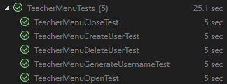
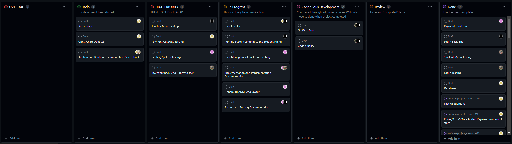

<!-- omit in toc -->
# Phase 3 - Implementation and Testing

<!-- omit in toc -->
## Team 1- Library System

<i>(bedbugexterminatorpro.ca, 2023)</i>

<!-- omit in toc -->

## Contents 
- [Contents](#contents)
- [Task Allocation](#task-allocation)
- [Implementation](#implementation)
  - [The `InventoryManager` Class](#the-inventorymanager-class)
  - [The `UserManager` Class](#the-usermanager-class)
  - [The `paymentGateway` partial class](#the-paymentgateway-partial-class)
  - [The `bookRental` partial class](#the-bookrental-partial-class)
  - [The `studentMenu` partial class](#the-studentmenu-partial-class)
  - [The `teacherMenu` partial class](#the-teachermenu-partial-class)
  - [The `loginScreen` partial class](#the-loginscreen-partial-class)
- [Testing](#testing)
- [Kanban](#kanban)
- [References and Acknowledgements](#references-and-acknowledgements)
  
## Task Allocation

**Table 1: Task Allocation**

| Username | Tasks |
|:---:|:---:|
| [th5528e](https://github.com/th5528e) | UI/XAML Design // Kanban // Inventory Testing
| [Repi909](https://github.com/Repi909) | Github Admin // User/Inventory Classes and Interface // Login and StudentMenu Testing
| [GeorgeElliotMathieson](https://github.com/GeorgeElliotMathieson) | Pull Requests // Hashing and Auth // TeacherMenu Testing
| [shuvo00000](https://github.com/shuvo00000) | README.md // Payment Methods // UserManager and bookRent Testing

## Implementation

### The `InventoryManager` Class
---

**The `InventoryManager` class** is responsible for managing the inventory of books and journals in the library system. It contains several methods that facilitate operations such as adding, deleting, editing, and retrieving inventory items and their information. 

**Core Methods**

**`OpenDatabaseFile()`:**

Opens the inventory database file(`.csv` format) and reads its contents into memory.

**`CloseDatabaseFile()`:**

Closes the inventory database file and saves the current state of the inventory data back to the database file. It concatenates the `tableHeaders` and `inventoryList` into a list of strings and writes it line by line to the CSV file.

**`CreateNewObject()`:**

Adds a new item to the inventory. It validates the input object items, checks if an item with the same name already exists, and adds the new item to the `inventoryList`.

**`DeleteObject()`:**

Deletes an item from the inventory.

**`GetObjectInfo()`:**

 Retrieves all information for a specific object (inventory item) by its name. It uses the `FindObjectInList` helper method to locate the object's index and then returns the entire row from `inventoryList` at that index.

**`EditObject:`**

Edits information about an item in the inventory. It uses helper methods to find the object's and field's index, then removes the old value and inserts the new edited value in the inventoryList.

**`FindObjectInList` and `FindFieldNameInList`:**

 These helper methods iterate through specific columns in the inventoryList to find the index of an object by name or a field, respectively.

---

### The `UserManager` Class
---

The `UserManager`class is responsible for managing user data, such as adding, editing, or deleting user data.

**Core Methods**

**`OpenDatabaseFile()`:**

Opens the Uer database file and reads its contents into memory. Reads the user data from a CSV file located at the specified path and initializes the `userList` and `tableHeaders` properties with the data read from the file.

**`CloseDatabaseFile()`:**

The purpose of this method is to save any changes made to the user data in the database file. The method first closes the user database file, then prepares the data to be written back to the file and writes the updated user data back to the database file to effectively save any changes made to the user data.

**`CreateNewObject()`:** 

Add new user to the user database.  It validates the input user data, ensuring that it is not null and that the object name does not already exist in the database. If no issues are found, it adds the new user to the `userList`.

**`DeleteObject()`:**

Deletes an user entry from the databse. It finds the index of the user by name and removes it from the `userList`.

**`EditObject()`:** 

Edits user information in the database. This method finds the user by name, locates the field to edit, and updates its value with the new information provided.

**`GetObejectInfo()`:**

To retrieve information about a specific user in the user database. It finds the user by name and returns its information as a list of strings.

**`GetSpecificObjectData()`:**

Retrieves specific data about a user from the user database. It finds the user by name, retrieves the index of the specified field, and returns the corresponding data for that field.

**`ToSHA512()`:**

Serves for password hashing using a secure algorithm (SHA512) for password storage.

---

### The `paymentGateway` partial class

The `paymentGateway` class is responsible for handling payment from the users through various types of cards. It facilitates the process of users making payments towards their owed fees or balances.

**Core Methods**

**`payFeesButton_Click`:**

Handles the logic for processing payments when the user clicks the "Pay Fees" button. It gathers information such as the credit card number, expiry date, CVC, and payment amount entered by the user. It validates the credit card details, checks if the payment amount exceeds the owed balance, and updates the user's balance in the database accordingly. If the payment is successful, it displays a confirmation message and navigates the user back to the student menu window.

**`IsValidCreditCard()`:**

Validates the credit card details entered by the user. It verifies that the credit card number, expiry date, and CVC meet the necessary criteria for a valid credit card.

**`GetCardType()`:**

This method determines the type of credit card based on its number. 

---
### The `bookRental` partial class

This class is responsible for handling searching and renting books in the library management system. Users are able to search for books or journals by entering the title, author, or ISBN number and they are alowed to rent books for 3,7 or 14 days.

**Core Methods**

**`titleSearch_TextChanged()`:**

Filters the list of available books based on the entered title, updating the search results displayed.

**`isbnSearch_TextChanged()`:**

It filters the books based on the ISBN number entered by user and shows the possible result.

**`authorSearch_TextChanged()`:**

Filters the available books and journals list by the searched author name and displays the result.

**`submitButton_Click()`:**

This function processes the selected book or journal for renting. This function updates the status of the book and records the rental duration and show the confirmation message upon button clicked.

---

### The `studentMenu` partial class

The `studentMenu` class in the LMS_WPFApp responsible for managing the user interface and interactions related to student-specific functionalities within the application. It provides options for students to view there own account, pay any outstanding balances and rent any books.

**Core Methods**

**`payFeesButton_Click()`:**

Opens the payment gateway window to allow the students pay there outstanding balence. This also Retrives the current outstanding balance and passes it to the payment gateway window.

**`rentBookButton_Click()`:**

Nevigates to the bookRental window for allowing students to rent books.

**`LoadDebtFromCSV()`:**

Shows the current outstanding balance of the user also the updated amount after paying.

---

### The `teacherMenu` partial class

This class provides options for staff or teacher to  manage user account, such as deleting existing account, creating new accont or edit information of the user.

**`deleteUserButton_Click()`:**

Deletes the existing user from the user data after confirming the deletion with a message box.

**`createUserButton_Click()`**

Alows staff to create new user. This function also hasesh the password using SHA512 before adding it to the user data.

**`GenerateUsername()`**

it generates a unique username based on the provided first name and last name. this function onstructs the username using the first letter of the first name, first letter of the last name, a random number, and a random letter.

---

### The `loginScreen` partial class

This class handles user login attempts, verifies credentials, and directs users to the appropriate menu based on their access level.

**Core Methods**

**`loginButton_Click()`:**

It provides a username and password input for users. Then it checks if the username exists in the user database and if the provided password matches the one stored in the database managed by the `UserManager` class. Then it provides message for unsuccessful login attempts. If the login is successful it nevigates the users to the appropiate menu based on their access level.

---

## Testing

**`teacherMenuTests`:**

The `teacherMenuTests` class contains unit tests for the following high-level teacher menu functionality:
- Opening window
- Closing window
- Generating usernames
- Creating new users
- Deleting users
- Database handling

All tests passed successfully (as shown in **Figure 8**), and the teacher menu functionality was verified to be working as expected.

**[Figure 8: Teacher Menu Test Results]()**

## Kanban

Kanban is a method of improving software development by means of creating a visual flow using boards and charts. The idea is to promote team communication, collaboration and visibility of project timelines and projections (Radigan, 2023).

Kanban originates from the manufacturing industry, specifically Taiichi Ohno from Toyota in Japan, where it literally translates to "signboard". Toyota continue their Kanban philosophy under a new name, "Just-in-Time" method (Toyota, 2023), where they focus more on incorporating lean principles however Kanban, in the last decade, has been on the rise in tech and is being used in an array of diverse software organisations.

Below is a screenshot of our project Kanban from 21/01/24 and will change throughout the project to include new tasks as they are defined and allocated. The board has been split into major categories that define each task's state which project contributors can use to visualise the progress of the overall project.

**[Figure 9: Kanban Board Phase/3](https://github.com/orgs/TeachingMaterial/projects/9)**

## References and Acknowledgements

We would like to thank the following for their contributions and support with this project:

[CompEng0001](https://github.com/CompEng0001) 
Nathanial Sadler

