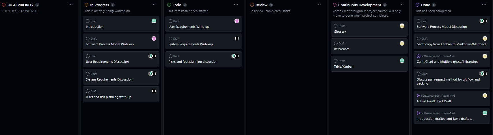

# Phase 1 - Requirements Engineering

# Team 1- Library System

___
### Contents
- [Phase 1 - Requirements Engineering](#phase-1---requirements-engineering)
- [Team 1- Library System](#team-1--library-system)
    - [Contents](#contents)
  - [Introduction](#introduction)
  - [Table](#table)
  - [Software Process Model](#software-process-model)
  - [Glossary](#glossary)
  - [User Requirements Definition](#user-requirements-definition)
  - [System Requirements Specification](#system-requirements-specification)
  - [Possible Risks and Risk Planning](#possible-risks-and-risk-planning)
  - [References and Acknowledgements](#references-and-acknowledgements)
  - [Gantt Chart of the Project Plan](#gantt-chart-of-the-project-plan)
  - [Kanban](#kanban)
___
## Introduction

The library system, comissioned to us as a project by our customer ***Blair&Co***, was the result of a need for a new and modernised system to monitor and control their extensive collection of computer hardware, programming and engineering manuals dating back to the early 1990s all the way through to generative AI journals printed this year by people such as OpenAI.

The team was given a specification by the customer which involved basic functions such as an inventory system through to advanced functions such as payment methods and authentication for security purposes.

The team decided a ***Plan Driven Incremental Design*** process was to be used as we could easily adapt to changing customer needs whilst also making deadlines key.

## Table

| Name | Tasks |
|:---:|:---:|
| Toby Hagon | Glossary // References // Gantt Chart & Kanban
| Jake Willshire | Github Project // Introduction // Github Admin
| George Mathieson | Risk and Risk Planning // User Requirements
| Azharul Haque Shuvo | Software Process Model // System Requirements
## Software Process Model
The software process model is an abstraction of a software development process. It explains a procedure from a particular perspective. Some of the most popular Software process models are:

- **Waterfall model:** It is a sequential, plan-driven process. It requires one to plan and schedule all activities before beginning the project.

- **Incremental model:**  The incremental model could be plan-driven or agile. In this model specification, development, and validation activities are interleaved rather than separate, with rapid feedback across activities.

- **Integration and Configuration:** This model assembles the system from pre-existing, configurable components.

We have chosen the Incremental model for our Library system project. 

### Explanation of Incremental model

The incremental model is now the most common approach for software development. It can be plan-driven or agile or a mixture of these approaches. The system increments are predetermined in a plan-driven method; if an agile approach is used, the early increments are predetermined, but the creation of subsequent increments depends on progress and client priorities.1 

This model is better than a waterfall model when system requirements are expected to change during the process. The way we solve issues is reflected in incremental development. We rarely figure out the entire solution to an issue up front; instead, we approach a solution incrementally and then go back when we see that we made a mistake. It is less expensive and simpler to make modifications to the software while it is being built when it is developed incrementally.1

### Incremental model stages:

**Requirement analysis:** In this stage, the project's requirements, such as its objectives, restrictions, and scope, are gathered and examined. Determining the resources required to finish the project and developing the overall project plan are also included in this step. This document undergoes multiple reviews and revisions after it is prepared before moving on to the next stage.2

**Design:** During this stage, the project team creates a comprehensive implementation plan that includes system design, technology selection, and the creation of any prototypes or proofs of concept that may be required.2

**Coding:** In this phase, the project is actually implemented by writing the code in accordance with the requirements of the final product. To update and improve the quality of the product, the coding standards must be properly followed, without using needless hard codes or defaults. Physical execution of the designs is also made possible at this point.2

**Testing:** This stage involves testing, integrating, and verifying the system's many parts as well as adding additional functionality. It is important to test the result after each code implementation to make sure it functions correctly with other code already produced for the same project. The system is then deployed to the production environment.2

### Advantages and Disadvantages

There are certain benefits and drawbacks to the incremental development process approach.

#### Benefits

* The software will be produced quickly throughout its life cycle.
* Changes to the requirements and scope are affordable and adaptable.
* At any stage in the development process, modifications could be made.
* Compared to other models, this model is less expensive.
* Customer feedback is welcome in every building.
* Errors are easy to identify.2

#### Drawbacks

* Proper planning and designing are essential
* As not every requirement is acquired in advance for the duration of the program, issues could occur.
* Fixing a problem in one unit requires a lot of time and work since each iteration step is rigid and does not cross over with the others.

### Reasons for choosing the Incremental model

One of the main reasons for choosing the Incremental model in our Library System project is requirements. The library system requirements can change with time and when we are going to unveil more information other requirements may fall off. When a project’s requirements are constantly changing it is best to work with the incremental model.

Another reason is that we can get customer feedback on the development work that has been done. Customers can comment on software demos and see how much has been implemented. 

Also, our team is small and inexperienced. For an inexperienced team, it is better to go with the incremental model.2 

The goals of the project are clearly stated and recognized, though some elements can change at each increment overtime.

By using the incremental model, we can make a good mix of plan-driven and agile methods. We can stay engaged with customers whilst also sticking to the timelines and project phases.

#### References
1. https://www.collegenote.net/curriculum/software-engineering-csit/52/298/
2. https://www.plutora.com/blog/incremental-model-what-and-how-to-implement-it#:~:text=The%20incremental%20model%20is%20a,thing%20from%20scratch%20at%20once.
3. https://biplus.com.vn/incremental-process-model-in-software-engineering

## Glossary
## User Requirements Definition
## System Requirements Specification
## Possible Risks and Risk Planning
## References and Acknowledgements
## Gantt Chart of the Project Plan
## Kanban